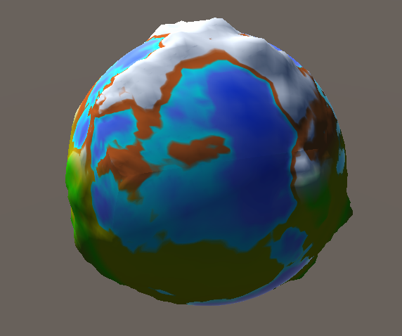

# ProceduralExperiments
This repository is all about experimenting with procedural generation on Unity.

## Endeavours
[x] Procedural Planets
[] Procedural Planets in DOTS

## Procedural Planets
Inspired by Sebastian Lague

Procedurally generated planets in Unity, there are still some things to fix.

ToDo:
[] Reimplement noise
[] Colors are not loaded properly sometimes

